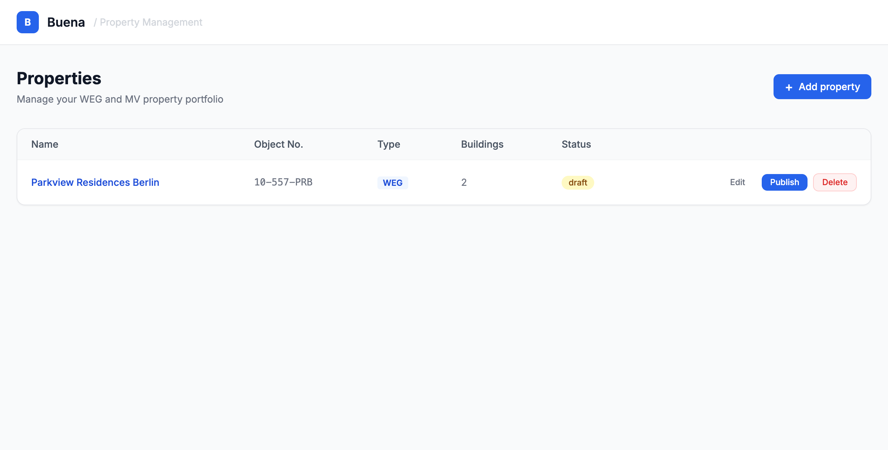
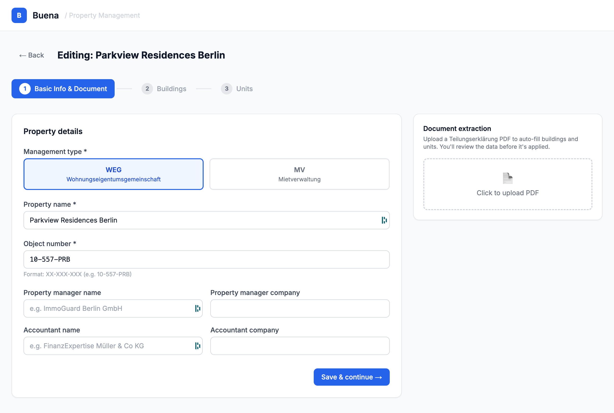
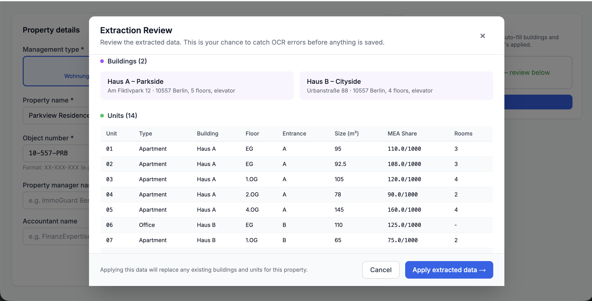
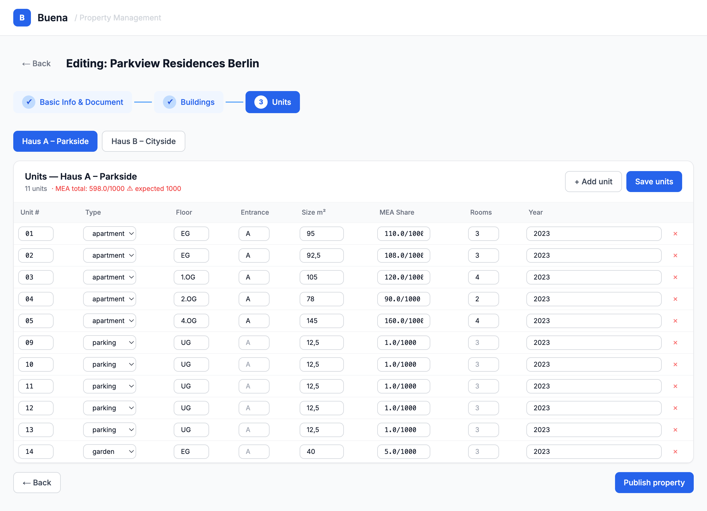

# Buena — Property Management Case Study

## The Problem

Property managers onboarding a 60-unit WEG property face hours of manual data entry.
A Teilungserklärung (condominium declaration) defines every unit in the building — unit number,
type, floor, co-ownership share — and digitising this document by hand is slow and error-prone.

This solution reduces that process from ~2 hours to ~10 minutes via **document-assisted onboarding**:
upload the PDF, review the extracted data, and apply it in one click.

---

## Screenshots

### Dashboard


### Onboarding Wizard


### Extraction Review


### Unit Grid


---

## Why This Workflow?

> The design is opinionated. Here's why each choice was made deliberately.

| Principle | Rationale |
|-----------|-----------|
| **No manual retyping** | Managers should not manually retype structured legal documents. A Teilungserklärung already contains every field — extraction surfaces it directly. |
| **Review before apply** | Users review extracted data before it is committed. OCR artifacts and non-standard abbreviations in legal documents are common; silent errors cost more to fix than 30 seconds of review. |
| **Bulk operations** | 60+ unit onboarding requires bulk insert. One API call per unit would hang the UI and leave partial state on failure. The grid saves all units in a single transaction. |
| **Draft mode** | Incomplete onboarding sessions are the norm, not the exception. Draft status lets managers pause and resume without losing progress. |
| **Inline editing** | Minimising page navigation reduces cognitive load. The unit grid lets managers correct extraction results and add missing units without leaving the wizard step. |

---

## Architecture

```
┌─────────────────────┐        ┌──────────────────────────┐
│  Next.js 14 (3000)  │──────▶ │  NestJS API (3001)       │
│  TypeScript         │  API   │  Prisma ORM              │
│  Tailwind CSS       │◀────── │  class-validator         │
│  App Router         │        │  multer (file upload)    │
└─────────────────────┘        └──────────┬───────────────┘
                                           │
                                ┌──────────▼───────────────┐
                                │  PostgreSQL 16           │
                                │  (docker-compose)        │
                                └──────────────────────────┘
```

| Layer      | Technology                                    |
|------------|-----------------------------------------------|
| Frontend   | Next.js 14, TypeScript, Tailwind CSS          |
| Backend    | NestJS 10, TypeScript                         |
| ORM        | Prisma 5 (schema-first, auto-generated client) |
| Database   | PostgreSQL 16                                 |
| File upload| multer (local disk for demo)                  |

---

## Domain Model

```
Property
├── id, name, object_number (unique), management_type (WEG|MV)
├── status (draft|active)  ← state machine
├── property_manager_name, property_manager_company
├── accountant_name, accountant_company
└── document_url

Building → Property (many-to-one)
├── name, street, house_number, additional_info, construction_year

Unit → Building (many-to-one)
├── unit_number, type (apartment|office|garden|parking)
├── floor, entrance, size_sqm
├── co_ownership_share (e.g. "110.0/1000")
├── rooms, construction_year

Extraction → Property (one-to-one)
└── status (pending|done|failed), raw_result (JSONB)
```

---

## API Endpoints

| Method | Path | Purpose |
|--------|------|---------|
| `GET` | `/properties` | List all properties |
| `POST` | `/properties` | Create draft property |
| `GET` | `/properties/:id` | Full detail with buildings + units |
| `PATCH` | `/properties/:id` | Update any field |
| `DELETE` | `/properties/:id` | Delete (drafts only) |
| `POST` | `/properties/:id/publish` | Draft → active |
| `POST` | `/properties/:id/buildings` | Add building |
| `PATCH` | `/buildings/:id` | Update building |
| `DELETE` | `/buildings/:id` | Delete building |
| `POST` | `/buildings/:id/units` | Add single unit |
| `POST` | `/buildings/:id/units/bulk` | Add units in one transaction |
| `PATCH` | `/units/:id` | Update unit |
| `DELETE` | `/units/:id` | Delete unit |
| `POST` | `/properties/:id/extract` | Upload PDF, trigger extraction |
| `GET` | `/properties/:id/extraction` | Get extraction result |
| `POST` | `/properties/:id/extraction/apply` | Apply extracted data |

---

## Running Locally

### Prerequisites

- Node.js 20+
- Docker (for PostgreSQL)
- npm

### 1. Start the database

```bash
docker-compose up -d
```

### 2. Backend

```bash
cd backend
npm install
cp .env.example .env    # uses postgres:postgres@localhost:5432/buena_db by default
npx prisma migrate dev --name init
npm run start:dev
```

Backend runs on **http://localhost:3001**

### 3. Frontend

```bash
cd frontend
npm install
npm run dev
```

Frontend runs on **http://localhost:3000**

### 4. Open the app

Navigate to [http://localhost:3000](http://localhost:3000) and click **"Add property"**.

---

## Key Design Decisions

### 1. Document-assisted onboarding (the core feature)

PDF upload triggers mock AI extraction that returns pre-parsed data from a sample
Teilungserklärung (Parkview Residences Berlin, 14 units across 2 buildings).

The extraction flow is **separated into two steps** on purpose:
- `POST /extract` — triggers extraction, stores raw result
- `POST /extraction/apply` — applies after human review

This "review before apply" step is non-negotiable. Legal documents have OCR artifacts,
non-standard abbreviations, and unusual floor labels. Committing wrong data silently is
worse than requiring 30 seconds of human review.

### 2. Bulk unit creation

For 60 units, 60 individual API calls would hang the UI.
`POST /buildings/:id/units/bulk` accepts an array and inserts in a **single PostgreSQL transaction** —
either all units are created or none are. This is also how the inline grid "Save units" button works.

### 3. Draft/publish state machine

Properties start as `draft` and must be explicitly published.
A manager onboarding a complex 60-unit property can't realistically finish in one session.
Draft status enables multi-session onboarding. Published properties are read-only in the dashboard.

### 4. Prisma over TypeORM

Schema-first approach, type-safe query client, and clean migration workflow.
The `Extraction` model uses `Json` (JSONB in PostgreSQL) for raw AI output
— avoids over-committing to a schema while the extraction format is still evolving.

---

## Deliberate Trade-offs

| Skipped | What I'd do in production |
|---------|--------------------------|
| Authentication | JWT + NestJS Guards, RBAC: admin / property manager / accountant |
| Real AI extraction | GPT-4o with structured output + Zod validation; confidence score per field; flag low-confidence fields red in review |
| Test coverage | Unit tests: MEA sum validator, unit type enum; Integration: wizard → publish flow, bulk insert transaction, extraction apply idempotency; E2E: Playwright for wizard |
| Async extraction | Bull/BullMQ job queue; SSE for real-time status updates |
| File storage | AWS S3 with signed URLs |
| MEA validation | DB-level check: SUM(co_ownership_share numerator) = 1000 per property |
| Real-time conflict | Optimistic locking with `version` field |

---

## What I'd Build Next

1. **Real OpenAI integration** — `gpt-4o` with structured output and a WEG-specific prompt
2. **CSV import** — alternative extraction path for managers with existing spreadsheets
3. **MEA sum validation** — highlight in red when co-ownership shares don't sum to 1000
4. **Duplicate detection** — prevent two properties with the same `object_number`
5. **Audit log** — immutable change history for published WEG properties (legal requirement)
6. **Bulk edit mode** — multi-select rows + batch update in the unit grid

---

## Project Structure

```
buena-property-mgmt/
├── docker-compose.yml
├── README.md
├── backend/
│   ├── prisma/
│   │   └── schema.prisma         # Single source of truth for DB schema
│   └── src/
│       ├── main.ts
│       ├── app.module.ts
│       ├── prisma/               # Global PrismaService
│       ├── properties/           # CRUD + publish
│       ├── buildings/            # CRUD scoped to property
│       ├── units/                # CRUD + bulk POST
│       └── extraction/           # PDF upload + mock AI + apply
└── frontend/
    └── src/
        ├── app/
        │   ├── page.tsx          # Property dashboard
        │   └── properties/new/   # Wizard entry point
        ├── components/wizard/
        │   ├── PropertyWizard.tsx # Step orchestrator
        │   ├── Step1BasicInfo.tsx # Form + PDF upload
        │   ├── ExtractionReview.tsx # Review modal
        │   ├── Step2Buildings.tsx # Buildings list
        │   └── Step3Units.tsx    # Inline editable unit grid
        └── lib/
            ├── api.ts            # Typed API client
            └── types.ts          # Shared TypeScript types
```
